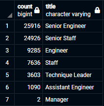
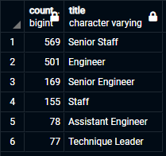

# Pewlett Hackard Analysis

A Structured Query Language (SQL) Study

## Overview

The Pewlett Hackard engineering firm approached "the Team" with several human resource challenges. The first was to migrate their employee data into a modern
database: PostgreSQL. The second was to utilize the new database and identify an upcoming series of retirements, namely from the Baby Boom Generation (i.e. 
born between 1952 and 1955). The final challenge presented was to identify eligible candidates for a proposd mentorship program. With the database built, this analysis
focuses on providing studies adressing the human resource retirement queries.

## Results

Figure 1: Number of Employess by Title Born between 1952 and 1955.

Figure 2: Number of Eligible Employees by Title Born in 1965 for Mentorship.
